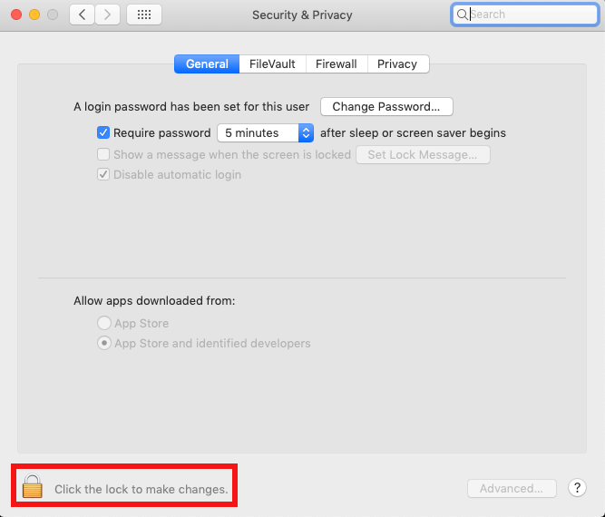

### Installatie
------

Open het .dmg bestand en sleep `RustDesk` naar `Toepassingen` zoals hieronder.

Zorg ervoor dat u alle RustDesk services heeft afgesloten. Zorg er ook voor dat u de RustDesk service in de taakbalk afsluit.

### Sta RustDesk toe

| Ontgrendel om te wijzigen | Klik op "App Store en erkende ontwikkelaars" |
| ---- | ---- |
|||

### Machtigingen Inschakelen

{}
Door de wijziging in het beveiligingsbeleid van MacOS werkt onze api, die de invoer aan lokale zijde vastlegt, niet meer... U moet "Input Monitoring" inschakelen op de lokale Mac.
Volg dit
[https://github.com/rustdesk/rustdesk/issues/974#issuecomment-1185644923](https://github.com/rustdesk/rustdesk/issues/974#issuecomment-1185644923)

Het lijkt geen snelle oplossing, we moeten het samen met onze Flutter-versie oplossen.
{}

Om het scherm vast te leggen moet u `RustDesk` **toegang** en **schermopname** toestemming geven. RustDesk leidt u naar het instellingenvenster.

| RustDesk Vensters | Instellingen Venster |
| ---- | ---- |
|||

Als u het heeft ingeschakeld in het instellingen venster, maar RustDesk waarschuwt nog steeds. Verwijder RustDesk uit het instellingen venster door de `-` knop, en klik op de `+` knop, en selecteer RustDesk in `Toepassingen`.

| `-` en `+` knop | Selecteer RustDesk |
| ---- | ---- |
|||

Kopieer bovenstaande stappen voor **schermopname** toestemming.

