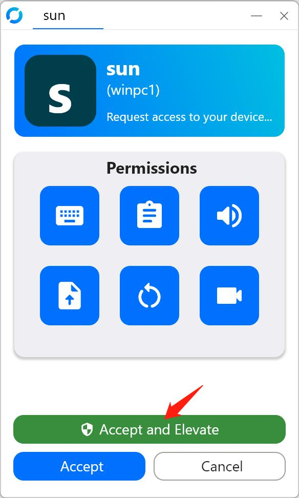
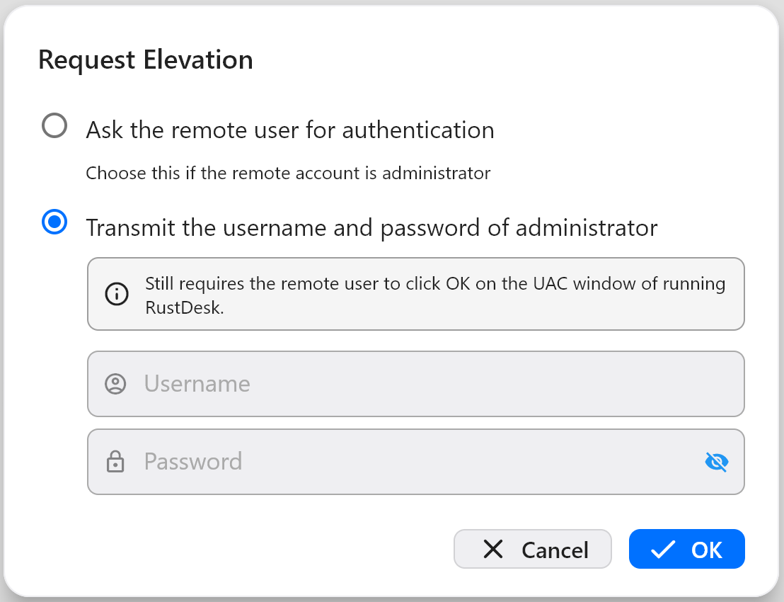
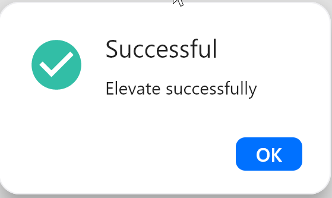

Programas portáteis do Windows não possuem privilégios de administrador, o que pode levar aos seguintes problemas:

- A tela não pode ser transmitida quando a janela de Controle de Conta de Usuário (UAC) aparece.
- Quando uma janela elevada, como o Gerenciador de Tarefas, aparece, o mouse fica sem resposta.

**Ao elevar privilégios, o RustDesk pode criar um processo com privilégios de administrador durante a inicialização ou uma sessão, permitindo realizar captura de tela e operações com o mouse, evitando assim os problemas acima.**

### Elevar na inicialização
Dessa forma, usuários remotos não precisam solicitar elevação ao se conectar. Existem dois métodos:

* Método 1: Altere o nome do programa portátil para incluir `-qs-` (versões 1.2.0, 1.2.1, 1.2.2, 1.2.3 terminam em `qs.exe`). Clique com o botão esquerdo do mouse para executar, clique em `Aceitar` na janela do UAC.

* Método 2: Clique com o botão direito e execute como administrador.

### Elevar na extremidade controlada

A extremidade controlada pode clicar diretamente em `Aceitar e Elevar` ao conectar ou clicar em `Elevar` quando já estiver conectado.

| Conectando | Conectado |
| :---: | :---: |
|  |  |

### Solicitar elevação na extremidade de controle

Após selecionar `Solicitar Elevação` no menu de ação, a seguinte caixa de diálogo aparecerá. Se você escolher `Pedir autenticação ao usuário remoto`, não será necessário inserir um nome de usuário e senha, mas o usuário no computador remoto deve ter privilégios de administrador. Se você selecionar `Transmitir o nome de usuário e senha do administrador`, o usuário no computador remoto só precisa aceitar na janela do UAC. Após enviar o pedido, aguarde o usuário do outro lado aceitar a janela do UAC. Após a confirmação, uma mensagem de sucesso aparecerá. Observe que ambos os métodos requerem que alguém na extremidade controlada aceite a janela do UAC. Portanto, se não houver ninguém disponível do outro lado, a elevação não deve ser solicitada na extremidade de controle.

| Menu | Dialogo |
| :---: | :---: |
|  |  |
| **Aguardando** | **Sucesso** |
|  |  |

### Como escolher
| Cenário | Método |
| :---: | :---: |
| Não é necessária elevação | Instalar o programa |
| Nenhum usuário disponível na extremidade controlada | Renomear *ou*  Executar como administrador |
| Usuário disponível na extremidade controlada *e*  Elevação imediata ao conectar *e*  Conexão aceitar-por-clique | Clicar em `Aceitar e Elevar` ao receber a conexão na extremidade controlada |
| Usuário disponível na extremidade controlada *e*   Elevação conforme necessário | Clicar em `Elevar` na janela de gerenciamento de conexão na extremidade controlada *ou*  solicitar elevação na extremidade de controle |
