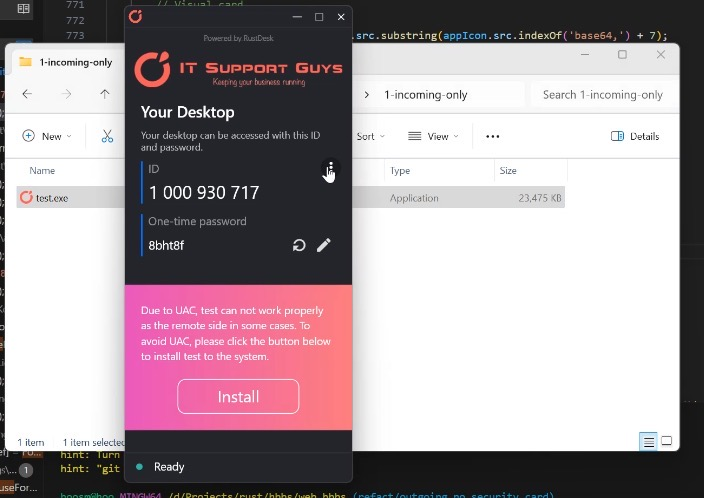
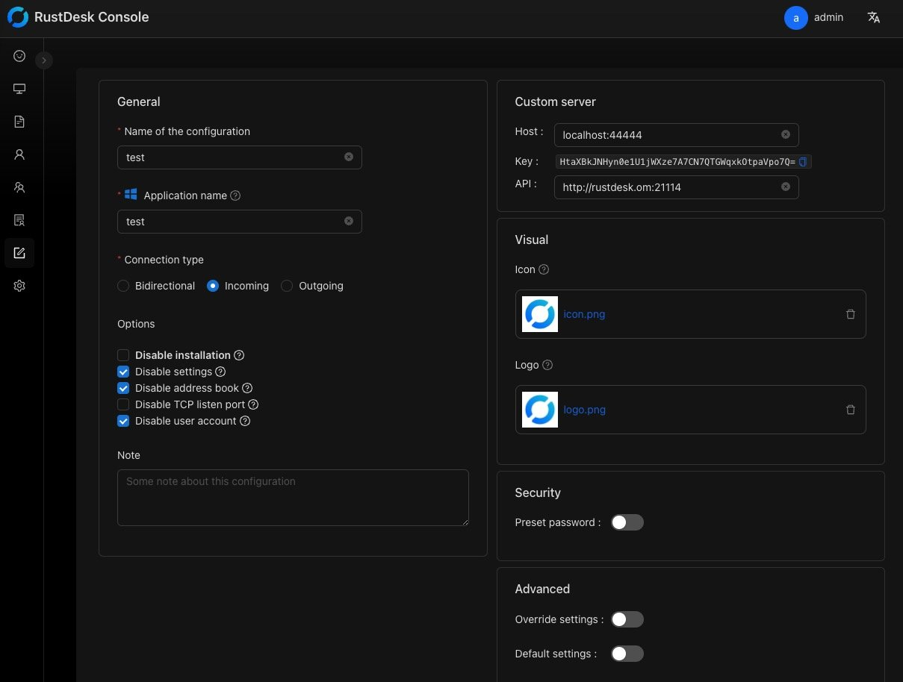

### Visão Geral
Existem várias maneiras de configurar os Clientes RustDesk para usar seu próprio servidor auto-hospedado, abordaremos algumas delas abaixo.

### 1. Gerador de cliente personalizado (Somente Pro)

Você pode ter seu próprio nome, logotipo, ícone, configuração, ser assinado e muito mais.

[Video](https://twitter.com/rustdesk/status/1769171628426944539)




### 2. Configuração Manual
Na tela inicial do Cliente RustDesk, clique no botão de Menu [ &#8942; ] ao lado do seu ID e depois em Rede. Agora você pode desbloquear as configurações usando privilégios elevados e definir seu ID, Relay, API e Keys.

Digite o host `hbbs` ou endereço IP na caixa de entrada **Servidor de ID** (lado local + lado remoto). Os outros dois endereços podem ser deixados em branco, o RustDesk irá deduzi-los automaticamente (se não estiverem especificamente definidos). O Servidor de Relay se refere a `hbbr` (porta 21117).

Exemplos:

```nolang
hbbs.example.com
```

Ou

```nolang
hbbs.example.com:21116
```

#### Defina a `Key`

Para estabelecer uma ligação encriptada ao seu servidor auto-hospedado, é necessário introduzir a sua chave pública. A chave é normalmente gerada na primeira execução do `hbbs` e pode ser encontrada no ficheiro `id_ed25519.pub` no seu diretório de trabalho / pasta de dados.

Como utilizador `Pro`, poderá também obter a `Key` a partir da [console web](https://rustdesk.com/docs/pt/self-host/rustdesk-server-pro/console/).


#### Definir `Servidor de API`

Esta opção é exclusiva para usuários `Pro`. Se você consegue fazer login no console web, mas não no cliente RustDesk, provavelmente não configurou o `Servidor de API` corretamente.

Se o seu Servidor de API não estiver usando a porta padrão `21114` (você pode não ter adicionado esta porta ao firewall se vier da versão open source), especifique o `Servidor de API` explicitamente.
Por exemplo, se o seu Servidor de API executa na porta HTTPS padrão, especifique o `Servidor de API` com `https://hbbs.exemplo.com`.

Se você ainda não consegue confirmar o valor do `Servidor de API`, vá para a página inicial do console web O `API Server` é mostrado na imagem acima (a caixa de entrada com a etiqueta `API:`).

### 3. Configuração usando Importar ou Exportar

1. Siga as etapas [acima](https://rustdesk.com/docs/pt/self-host/client-configuration/#configuração-manual) para configurar o Cliente RustDesk em um dispositivo.
2. Na máquina configurada, vá para ≡ (Configurações), depois Rede e desbloqueie.
3. Clique em  (`Exportar Configuração do Servidor`.)
4. Cole a string copiada no Bloco de Notas ou similar.
5. Acesse o novo cliente, copie o texto do bloco de notas para a área de transferência.
6. No Cliente RustDesk, vá para Configurações, depois Rede, desbloqueie e clique em  (`Importar Configuração do Servidor`.)
7. As configurações serão automaticamente importadas.
8. Clique em `Aplicar`.

### 4. Configuração Automática

A maneira mais fácil de configurar automaticamente é usar scripts de implantação encontrados [aqui](https://rustdesk.com/docs/pt/self-host/client-deployment/).

Você pode definir a senha como obrigatória e usar uma string codificada em Base64 reversa no formato `{"host":"HOSTADDRESS","key":"HOSTKEY","api":"http://HOSTADDRESS:21114"}` para configurar automaticamente os clientes. Isso está disponível automaticamente com o RustDesk Server Pro por meio do console.

Você também pode seguir as etapas [acima](https://rustdesk.com/docs/pt/self-host/client-configuration/#configuração-usando-importar-ou-exportar) para exportar a string, remova qualquer `=` do início ou do final da string. Reinicie o Cliente RustDesk se as configurações não forem exibidas.

### 5. Inserir configuração no nome do arquivo rustdesk.exe (somente Windows)

Altere `rustdesk.exe` para rustdesk-`host=<endereço-ip-ou-nome-do-host>,key=<cadeia-de-caracteres-da-chave-pública>`.exe, por exemplo rustdesk-`host=192.168.1.137,key=xfdsfsd32=32`.exe. Você pode ver o resultado da configuração na janela Sobre abaixo.

Como usuário `Pro`, você poderá recuperar a string criptografada inteira do [console web](https://rustdesk.com/docs/en/self-host/rustdesk-server-pro/console/) e, em seguida, baixar e renomear o executável do Cliente RustDesk. Você pode carregá-lo em um local fácil para seus clientes usarem.


<a name="invalidchar"></a>
{}
É necessário definir tanto `host` quanto `key`, a falta de qualquer um deles não funcionará.

Opcionalmente, adicione um caractere `,` (vírgula) após a chave, antes da parte `.exe` como delimitador, para evitar que a chave seja truncada se o Windows ou o navegador renomear o arquivo ao baixar nomes duplicados, por exemplo `host=<endereço-ip-ou-nome-do-host>,key=<cadeia-de-caracteres-da-chave-pública>,.exe`.

Se houver caracteres inválidos na chave que não possam ser usados em um nome de arquivo do Windows, remova o arquivo `id_ed25519` do seu servidor e reinicie `hbbs/hbbr`. Isso fará com que o arquivo `id_ed25519.pub` seja gerado novamente. Você pode precisar repetir esse processo até obter caracteres válidos.
{}

#### Embasar string de configuração com `--` no nome

Exemplo: `rustdesk--{string-de-configuração}--.exe`

{}
Por favor, não use `-licensed-` junto com `--`, por exemplo `rustdesk-licensed-{string-de-configuração}--.exe` não funciona na versão 1.2.3. Corrigiremos isso na versão 1.2.4.
{}

Percebemos que, em alguns casos, quando baixado duas vezes, algo como `cópia (1)` é adicionado ao final do nome do arquivo, o que corrompe a configuração.

Ao adicionar `--` no final, logo após a nossa string de configuração, mesmo que algo seja adicionado ao nome do arquivo, a string de configuração não será corrompida e o RustDesk a recuperará corretamente.

### 6. [Configurações Personalizadas de Codificação](https://rustdesk.com/docs/pt/self-host/client-configuration/hardcode-settings/)

### 7. Use a linha de comando `--config`
`rustdesk.exe --config <string-de-configuração>`

Você pode obter a string de configuração do console web (você pode vê-la na imagem acima) ou do cliente RustDesk "Configurações → Rede" ([aqui](https://github.com/rustdesk/rustdesk/discussions/7118) (Em inglês) há uma discussão sobre isso).

### 8. [Configurações Avançadas](https://rustdesk.com/docs/en/self-host/client-configuration/advanced-settings/)
