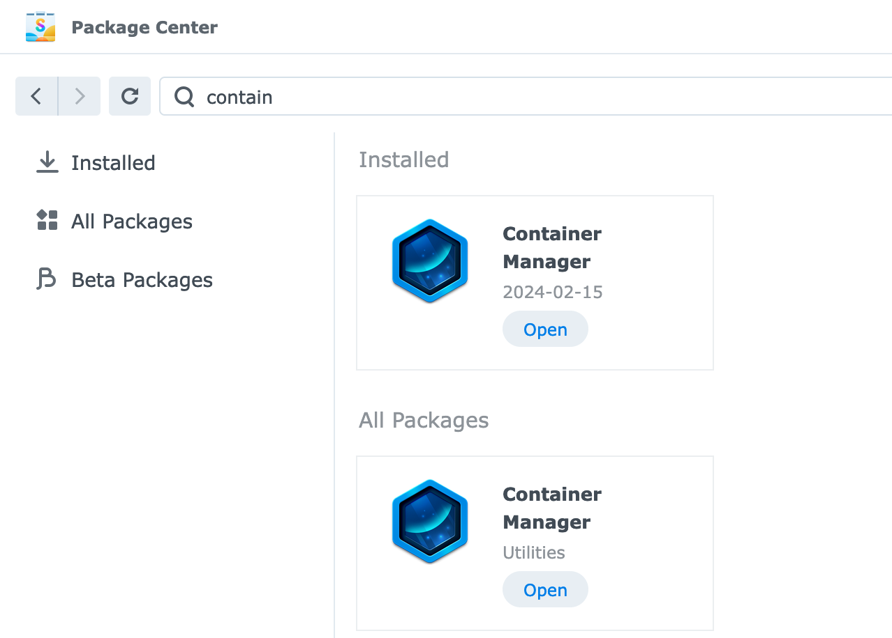
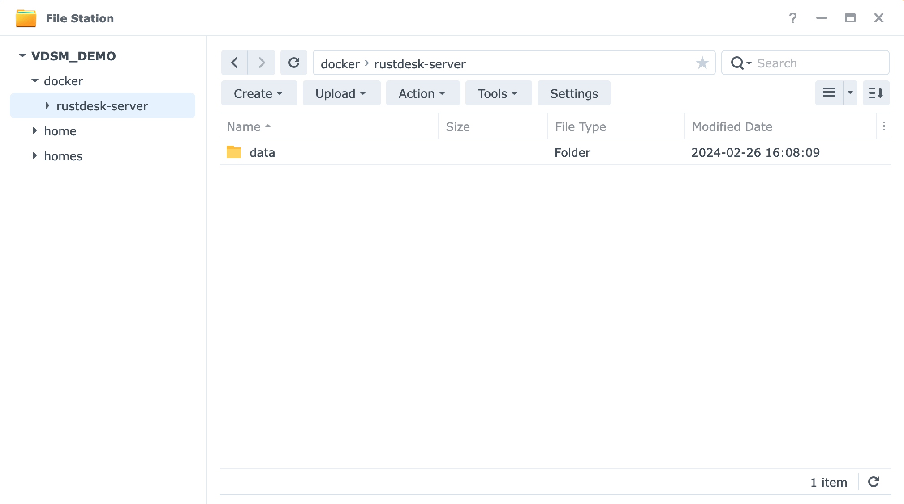
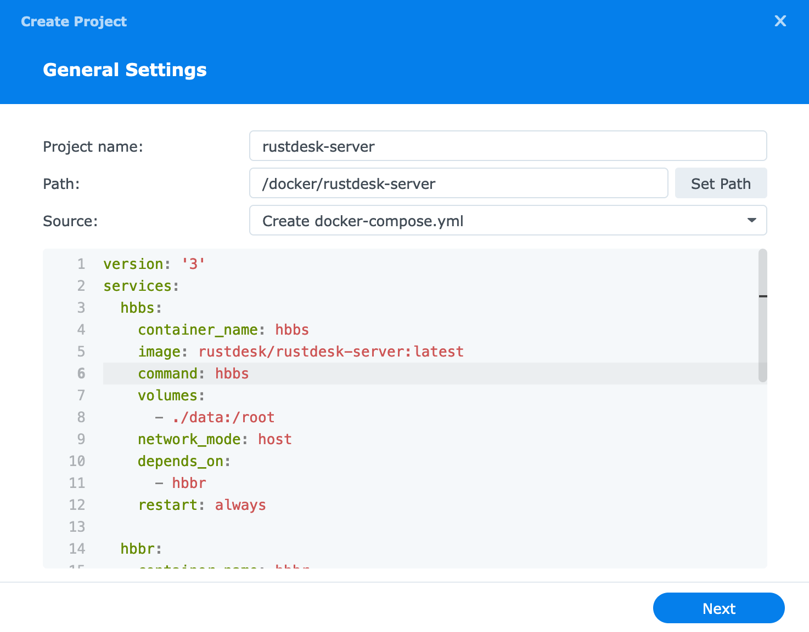
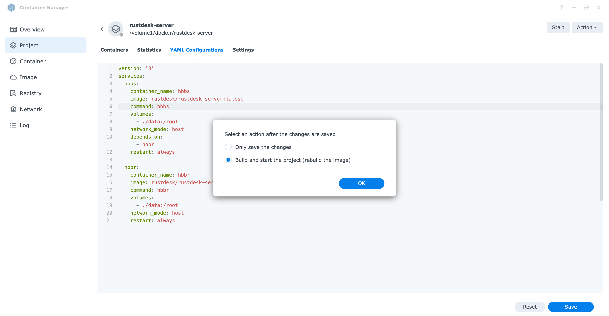

<!-- For translators: When translating elements like "buttons", don't just translate, please refer actual naming in their interface. -->
After DSM 7.2 update, Synology renamed their "Docker" package to "Container Manager". It brings a new GUI, and comes with "docker-compose" within its GUI, which make you create Docker more easily.

### Supported models and requirements

Container Manager brings ARM64 support for some low-end models, such as J series, for detail list of supported model, please check [Synology website](https://www.synology.com/en-us/dsm/packages/ContainerManager).
Most of time you won't need to install extra RAM for install Docker and RustDesk Server.

### 1. Install Container Manager (Docker)

Open "Package Center", search and install "Container Manager".



### 2. Create folder

After you installed "Container Manager", it will create a Shared Folder called `docker`, let's put our server's data here.

Open your File Station, create a folder named `rustdesk-server`(or whatever you like). Then create a folder named `data` in it just like the picture.



### 3. Create container

Open your Container Manager, go to Project and click Create.

Enter the project name `rustdesk-server` and change Source from "Upload compose.yml" to "Create compose.yml", and copy following contents to the box. After you copied, you should replace `rustdesk.example.com` (Which point to your `hbbr`) to the domain that will point to your NAS.

{}
You could modify the line with `hbbs` to your NAS's LAN IP temporarily just like the picture. After you verify your server is working, you **should** change back.
{}



```yaml
services:
  hbbs:
    container_name: hbbs
    image: rustdesk/rustdesk-server:latest # please change this to rustdesk/rustdesk-server-pro:latest if you want to install Pro.
    command: hbbs -r rustdesk.example.com:21117 -k _
    volumes:
      - ./data:/root
    network_mode: host
    depends_on:
      - hbbr
    restart: always

  hbbr:
    container_name: hbbr
    image: rustdesk/rustdesk-server:latest # please change this to rustdesk/rustdesk-server-pro:latest if you want to install Pro.
    command: hbbr -k _
    volumes:
      - ./data:/root
    network_mode: host
    restart: always

# Because using docker host mode
# Just in case you forgot the ports:
# 21114 TCP for web console, only available in Pro version
# 21115 TCP for NAT type test
# 21116 TCP TCP hole punching
# 21116 UDP heartbeat/ID server
# 21117 TCP relay
# 21118/21119 TCP for web socket if you want to run web client
```

Please skip `Web portal settings` then done.

### 4. Check it is working

Open your File Station, you should see `id_ed25519`, `id_ed25519.pub` on your `docker/rustdesk-server/data` folder. You could download it and open it though any text editor or use [Synology Text Editor](https://www.synology.com/en-us/dsm/packages/TextEditor). This is the public key that you need for your RustDesk client.

The public key will looks like this:


Check [here](/docs/en/client) to set up your client. Only `ID server` and `Key` is needed. `Relay server` isn't needed because we've set it in `hbbs`, `hbbs` will provide this information automatically.

### 5. Set your hbbs to point to your domain

If you have set your `hbbs` command to point to your LAN IP, and verified it is working, it is time to change to the domain, as it will not work when attempting to use it outside of your LAN.
<hr>

5.1. Go to Container Manager → Project → Click "rustdesk-server" → Action → Stop

5.2. After stopped, click "YAML Configurations", modify the line start with `command: hbbs` to your domain, then click "Save". Make sure you choose "Build and start the project (rebuild the image)".



5.3. Your RustDesk Server should ready for connections from the Internet, next, you should setup port forwarding.

{}
Having problem after you done this step? You should check [this article](/docs/en/self-host/nat-loopback-issues/).
{}

### 6. Set port forwarding on your router

Go to your router's admin webpage, find anything related to `Port forwarding`, it should appear in `WAN` or `Firewall` settings.

If you still can't find the setting, Google search `{Router brand} + port forwarding` or `{Router model} + port forwarding`. If this device is from your ISP, ask them.

Open these required ports:
  * `21114` TCP for web console, only available in Pro version
  * `21115` TCP for NAT type test
  * `21116` TCP TCP hole punching
  * `21116` UDP heartbeat/ID server
  * `21117` TCP relay
  * `21118/21119` TCP for web socket if you want to run web client

